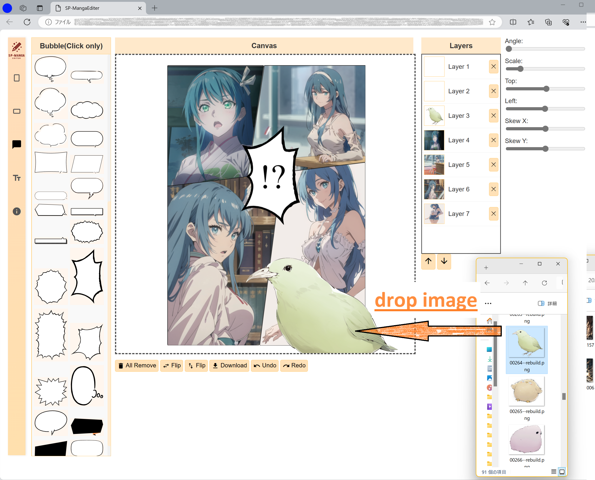

# Simple Manga Editor

This project is a simple manga editor built solely with HTML, CSS, and JavaScript. It provides tools to edit manga panels directly in the browser.

## Features

- **Manga Panel Support**: Use pre-prepared manga panels to easily create comic frames.
- **Speech Bubble Insertion**: Drag and drop pre-prepared speech bubbles into comic frames for automatic application.
- **Overlay Display**: Dragging and dropping outside the frame area allows for displaying items as overlays.
- **Layer Display**: Manage multiple images and texts as layers, streamlining the editing process.
- **Image Editing Features**: Adjust image angles, positions, scale, and movements along the X and Y axes. Support for flipping images horizontally and vertically is also included.
- **Undo/Redo Functionality**: Easily undo and redo editing actions.
- **Image Saving**: Edited images can be directly saved to the download folder.

## Screenshots

Below are screenshots demonstrating the use of the editor.

Editor Interface

Sample Image 1

Sample Image 2

## How to Use

1. Clone or download the repository.
2. Open the `index.html` file in a browser.
3. Select manga panels from the interface and place them via drag and drop.
4. Add speech bubbles or images and make necessary edits.
5. Use the menu bar at the top to save or perform undo/redo operations.

―――

# シンプル漫画エディタ

このプロジェクトは、HTML、CSS、JavaScriptのみで構成されるシンプルな漫画エディタです。ブラウザ上で直接漫画のパネルを編集できるツールを提供します。

## 特徴

- **漫画パネルのサポート**: あらかじめ用意された漫画パネルを使用して、漫画のコマを簡単に作成できます。
- **フキダシの挿入**: 用意されたフキダシをドラッグアンドドロップで漫画のコマに追加でき、自動で適用されます。
- **オーバーレイ表示**: コマの領域外にドラッグアンドドロップすることで、オーバーレイとして表示も可能です。
- **レイヤー表示**: 複数の画像やテキストをレイヤーとして管理し、編集作業を効率化します。
- **画像編集機能**: 画像の角度、位置、拡大縮小、X軸、Y軸の移動が可能です。また、画像の左右反転や上下反転もサポートしています。
- **Undo/Redo機能**: 編集の取り消し（Undo）ややり直し（Redo）が簡単に行えます。
- **画像の保存**: 編集した画像は、直接ダウンロードフォルダへ保存可能です。

## スクリーンショット

以下のスクリーンショットでエディタの使用例をご覧いただけます。

操作画面

サンプル画像１

サンプル画像２

## 使い方

1. レポジトリをクローンまたはダウンロードします。
2. `index.html` ファイルをブラウザで開きます。
3. インターフェイスから漫画のパネルを選択し、ドラッグアンドドロップで配置します。
4. フキダシや画像を追加し、必要に応じて編集を行います。
5. 上部のメニューバーから保存やUndo/Redoを利用できます。
