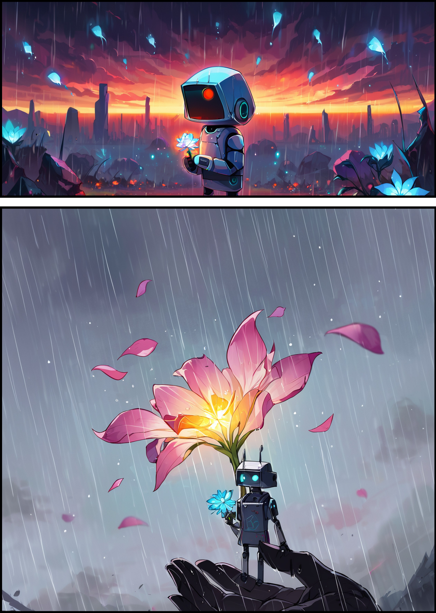
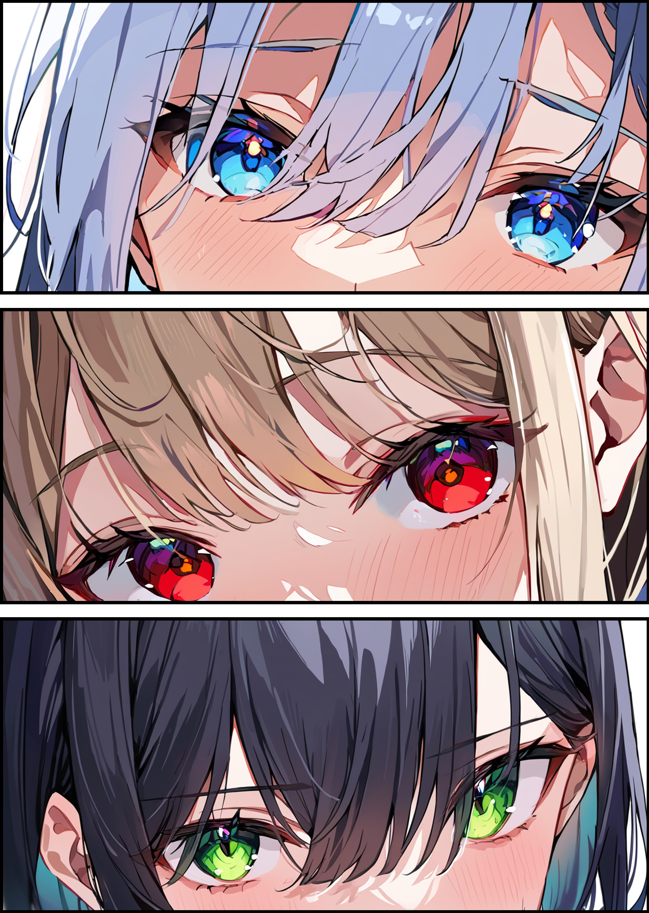
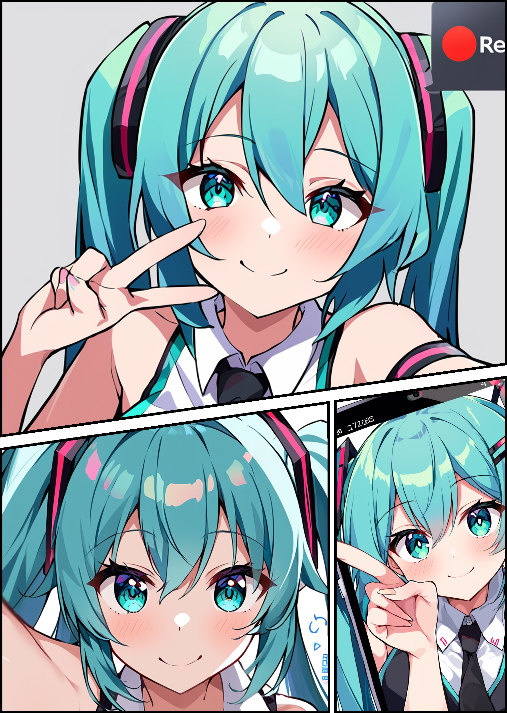

[English](https://github.com/new-sankaku/stable-diffusion-webui-simple-manga-maker/blob/main/README.md) : [日本語](https://github.com/new-sankaku/stable-diffusion-webui-simple-manga-maker/blob/main/README_JP.md) : [中国語](https://github.com/new-sankaku/stable-diffusion-webui-simple-manga-maker/blob/main/README_CH.md)
  
Features  
   - Simple and easy manga style image creation function.  
   - Multiple Manga Panel images are available.  
   - You can also add your own Manga Panel images.  
   - Frames are automatically detected and numbers are assigned.  
   - Apply images according to number.  
   - Supports PNG images.  
   - Also supports transparent images.  
  - Flip image horizontally  
  - Restore changed images

Features planned for implementation  
  - Add callouts, add text, apply overlay images  
  - Image reduction, cropping  
    Gradio4 compatibility on the Web UI side is required.   
    There is a PR so I think it will be addressed soon.  
  
# Stable Diffusion Web UI Extension  
This extension is for creating simple manga-style images.  
It's meant for easily creating manga-style images without the need for advanced operations or owning image editing software.  

Note that this extension allows for manually fitting selected images into comic panel layouts.  

It does not support automatically creating manga-style images after image generation. You must manually select the images.  
Although automation is technically possible, it was deemed impractical as it may not always generate the desired images.  

## Install
・For Stable Diffusion WebUI
Click the Extensions tab, then click the Install from URL inner tab. Paste the repository URL below and click Install.
https://github.com/new-sankaku/stable-diffusion-webui-simple-manga-maker

## How to Use  
Using it is simple:  

1. Select a comic panel image that is provided.  
2. Click the 'New Image' button.  
3. Choose the image you wish to apply.   
4. Click the 'Apply Image' button.  

## Operation Screen  
Select a comic panel image.  
  

Simply apply any desired image next.  
  

## Sample Images  
  

  

  

Developers  
[https://twitter.com/hypersankaku2](https://twitter.com/hypersankaku2)  
